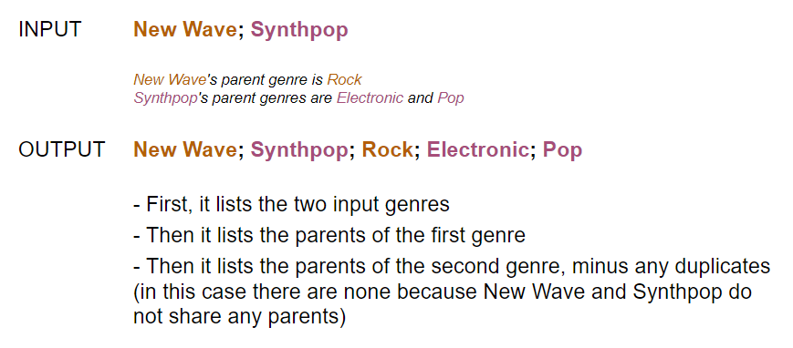
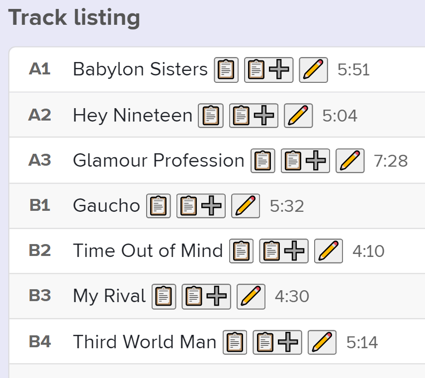

# Project Gaucho
Project Gaucho is an ongoing personal project focused on streamlining music library categorization.

Listening to music is one of my most treasured hobbies. For years, I have been keeping a comprehensive spreadsheet of all the songs in my library including their release dates, languages, genres, as well as custom descriptors such as "late night", "relaxation", "energetic", etc. The general purpose of this project is to make it easier for me to enjoy my music-listening hobby, and one way of doing that is by creating programs to make information entry into this spreadsheet quicker and more convenient.

The **"Genre Tree Program"** allows me to enter a list of genres, and the program will return all of the parent genres of each genre in the list, based on the information within the program's genre dictionary database. Here is a simple example, visualized:

_Note: The genre dictionary database is based off of the genre tree of the Rate Your Music website. See more info here: [https://rateyourmusic.com/genres/](url)_

The **"Glamour Extension"** is a Chrome extension for the Rate Your Music website. In short, it makes clipboard and pencil buttons appear next to song names. When the clipboard (📋) button is pressed, it copies the name of the song to my clipboard. In the example below for the tracklist of Steely Dan's 1980 album "Gaucho," if I press the clipboard (📋) button next to "Babylon Sisters," it will copy that song title to my clipboard, which allows for ease of entry into the spreadsheet. There are other features as well: The clipboard plus (📋➕) button also copies the name of the artist in an "Artist - Song" format ("Steely Dan - Babylon Sisters"), and the pencil (✏️) button copies even more information including the release year, the language, etc.

Both of these programs are still in development; the latter has not been made publicly available on the Chrome Web Store and I have just been using it for personal purposes. There are plans for additional programs as well.
